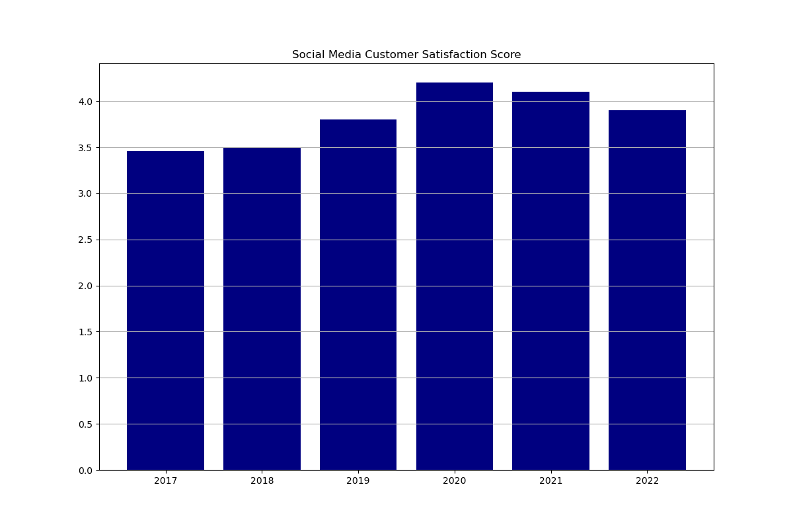

[](https://github.com/tursunait/Individual_Project_Tursunai_DE/actions/workflows/install.yml)
[](https://github.com/tursunait/Individual_Project_Tursunai_DE/actions/workflows/format.yml)
[](https://github.com/tursunait/Individual_Project_Tursunai_DE/actions/workflows/test.yml)
[](https://github.com/tursunait/Individual_Project_Tursunai_DE/actions/workflows/lint.yml)
# IDS 706 Individual Project 1 - Tursunai Turumbekova

### 📂 Project Structure
```
.
├── .devcontainer
│   ├── Dockerfile
│   └── devcontainer.json
├── .github
│   └── workflows
│       ├── format.yml
│       ├── install.yml
│       ├── lint.yml
│       └── test.yml
├── mylib
│   ├── lib.py
│   └── test_lib.py
├── .gitignore
├── Makefile
├── README.md
├── requirements.txt
├── main.ipynb
├── MTA.md
├── main.py
├── test_main.py
├── bar.png
├── bar2.png
└── MTA_NYCT_Stat.csv
```

### 📊 Dataset Description
In this project, MTA NYCT Customer Engagement Statistics has been loaded. This dataset provided statistics and performance metrics about the volume and responsiveness in engaging with customers via several customer engagement channels. Data was provided for New York City Transit Subway and Bus customer engagement and customer service teams between May 2017 and May 2022. A python script with Pandas is used to read the dataset, generate the summary statistics, and create the data visualization on seasonality of incoming calls showcased by each month, and social media stisfaction rate by year.

### 📋 Summary Statistics 

Describe:
|    | Statistic          |   Value      |
|---:|:-------------------|-------------:|
|  0 | Mean               | 68180.704918 |
|  1 | Median             | 70568.000000 |
|  2 | Standard Deviation | 14093.932965 |


### 🔍 Visualizations
The script generates two visualizations:

1. Bar Chart - Displays the seasonality of incloming calls to NYC MTA.


2. Bar Chart - Displays the social media satisfaction score over years


General statistics and the visualizations for the NYC MTA customer stisfaction data can be viewed through the following link:
[Click here to view details](MTA.md)

### 🎥 Demo Video


